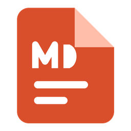
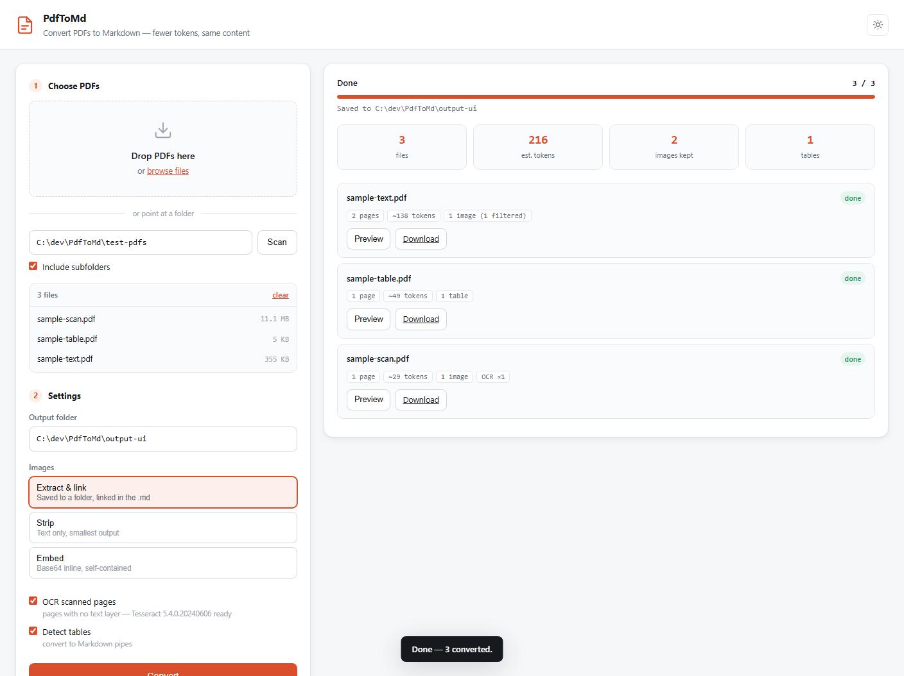

<div align="center">



# PdfToMd

**Turn PDFs into Markdown that an LLM can actually read.**

Extracts text and heading structure, converts ruled tables to Markdown, filters
decorative images, detects two-column layouts, and OCRs pages that have no text
layer. Local web UI and command line — nothing leaves your machine.

[](https://github.com/smehri/PdfToMd/actions/workflows/ci.yml)
[](LICENSE)
[](https://www.python.org/downloads/)
[](#privacy)



</div>

---

## Why

Feeding a PDF to an AI assistant is expensive. Pages arrive as images, so a
40-page report can cost tens of thousands of tokens — and the text inside can't
be searched or quoted, only looked at.

Converting to Markdown first changes that:

| In the PDF | In the Markdown | Tokens |
|---|---|---|
| A page of text | The same text, no layout | roughly the same |
| A table as a bitmap | Markdown pipes | ~1,500 → ~200 |
| A chart or figure | `` | ~1,000 → ~8 |
| A logo on every page | dropped | ~750 → 0 |
| A running header on every page | dropped | ~15/page → 0 |

The image link is the key idea. A reference costs about 8 tokens, so you pay
nothing upfront — and the picture is still on disk, ready to attach to a
conversation on the one occasion a question actually needs it.

**How much you save depends on the document.** On a figure-heavy report the
difference is large. On dense prose it is modest — the text is roughly the same
size either way, and the real gain is that it becomes searchable and quotable.
[`examples/`](examples/) has a full 14-page paper converted, with the numbers
measured rather than estimated, including where the converter does badly.

## Quick start

**1. Get the code**

```bash
git clone https://github.com/smehri/PdfToMd.git
cd PdfToMd
```

**2. Set up Python** (3.10 or newer)

```bash
python -m venv .venv
.venv\Scripts\activate           # Windows
# source .venv/bin/activate      # macOS / Linux
pip install -r requirements.txt
```

**3. Run it**

```bash
python -m pdftomd
```

Your browser opens at <http://127.0.0.1:8765>. Drag PDFs in, or type a folder
path and press **Scan**. Choose an output folder, hit **Convert**.

That's it — the defaults are already the right ones.

### Windows: a desktop icon

To skip the terminal entirely:

```powershell
powershell -ExecutionPolicy Bypass -File scripts\install_shortcut.ps1
```

That puts a **PdfToMd** icon on your desktop. Double-click it and the app
opens in your browser — no console window. Add `-StartMenu` to also list it in
the Start Menu, or `-Remove` to take the shortcuts away.

### Try it without your own PDFs

```bash
python scripts/make_test_pdfs.py
```

Creates `test-pdfs/` with four samples — a plain document, one with a ruled
table, a scanned one with no text layer, and a two-column page — covering every
code path.

## OCR (optional)

Scanned PDFs have no text layer: without OCR they convert to nothing. Install
Tesseract and PdfToMd will read those pages automatically.

```powershell
winget install --id UB-Mannheim.TesseractOCR --source winget   # Windows
```
```bash
brew install tesseract                                          # macOS
sudo apt install tesseract-ocr                                  # Debian/Ubuntu
```

The app finds it automatically in the usual locations — on Windows the
installer does not add it to `PATH`, which is handled. If yours is somewhere
unusual, set `TESSERACT_CMD` to the full path of the binary.

The UI tells you whether OCR is ready **before** you convert. Without it, files
still convert and carry a warning naming the pages that were affected, rather
than quietly producing a blank document.

## Command line

For batch jobs and scripting:

```bash
# One file
python -m pdftomd.cli report.pdf -o output

# Several files and a whole folder
python -m pdftomd.cli a.pdf b.pdf ./papers -o output

# Text only, no images
python -m pdftomd.cli ./papers -o output --images none
```

| Flag | Meaning |
|---|---|
| `-o, --output` | Output directory (default `output`) |
| `--images extract` | Save images to a folder and link them — **default** |
| `--images none` | Strip images; smallest output |
| `--images embed` | Inline as base64; self-contained but very large |
| `--no-ocr` | Skip OCR on scanned pages |
| `--no-tables` | Skip table detection |
| `--no-recursive` | Do not descend into subfolders |

## The three image modes

They differ only in where the image data ends up — and that decides the cost.

| Mode | The Markdown contains | Same test file |
|---|---|---|
| **Extract & link** (default) | `` | 564 bytes |
| **Strip** | nothing | 507 bytes |
| **Embed** | `` | **43,105 bytes** |

**Use Extract & link.** It is the only option that is both cheap and lossless.

*Strip* saves a rounding error over linking — because a link was already nearly
free — while permanently discarding the pictures. *Embed* makes one portable
file, but at **76× the size** for identical content, and base64 tokenizes badly
(~2–3 characters per token), so the token cost is worse still. Embed is useful
for archiving or email; it is the wrong choice for AI context.

## Output layout

```
output/
  quarterly-report.md
  quarterly-report-images/
    page001-01.png
    page004-02.png
```

Image links are relative, so the `.md` and its folder can be moved together and
the links keep working.

## How images are filtered

Most images embedded in a PDF are decoration. Extracting them all leaves you
with a folder of bullet glyphs and the company logo repeated 40 times. These
are dropped automatically:

- smaller than 100×100 px, or under 5 KB — icons and glyphs
- aspect ratio beyond 10:1 — divider rules
- under 1% of the page area
- 1-bit or 2-colour — rules and separators
- the same image on more than half the pages — logos and watermarks
- exact duplicates of an image already kept

On a typical business PDF this removes most of what gets extracted. Every
result reports how many were dropped and why, so nothing disappears silently.

## Known limitations

Stated plainly, because they show up on real documents —
[`examples/`](examples/) demonstrates each on an actual paper:

- **Unruled tables are not converted.** Detection needs drawn lines. Tables
  aligned only by whitespace stay as text. PyMuPDF's alternative strategy
  cannot isolate them either -- it returns the whole column, prose included --
  so using it would corrupt the text rather than add a table.
- **A table drawn as vector graphics** has no text to extract at all, so it is
  kept as an image reference. The example paper's Table 1 is one of these.
- **Vector charts are not extracted.** They are drawing instructions rather
  than embedded bitmaps. Their text is still captured.
- **Figure captions run into body text** rather than attaching to a figure.
- **Multi-column layouts** are detected, and each column is searched for
  tables separately. Text is still read in block order, which is correct for
  ordinary two-column papers.

## What the token numbers mean

The **est. tokens** figure is the Markdown's character count divided by 4 — the
usual rough ratio for English prose. Treat it as an approximation and a way to
compare files, not a billing figure. It under-estimates for tables, code, and
non-English text (Persian, Arabic, and CJK can run 1–2 characters per token).

It counts the Markdown only. Linked images cost nothing until you actually
attach one, which is the entire point of the default mode.

## Privacy

Everything happens on your machine. PDFs are read locally, Markdown is written
locally, and nothing is uploaded. The server binds to `127.0.0.1`, so it is not
reachable from other machines on your network. The UI loads no fonts, scripts,
or styles from any CDN.

## Project layout

```
PdfToMd.vbs              double-click launcher (Windows, no console window)
assets/                  app icon
scripts/
  install_shortcut.ps1   creates the desktop / Start Menu shortcut
  make_test_pdfs.py      generates sample PDFs
pdftomd/
  convert.py             PDF → Markdown: text, headings, tables, OCR
  images.py              extraction and the filtering heuristics
  ocr.py                 Tesseract discovery
  server.py              FastAPI app and the progress stream
  cli.py                 command-line interface
  static/                the web UI (no build step, no framework)
```

## Contributing

Issues and pull requests are welcome — see [CONTRIBUTING.md](CONTRIBUTING.md)
for how to set up and what the code aims for.

## License

[AGPL-3.0](LICENSE), because PyMuPDF — the PDF engine — is AGPL-3.0 and that
license is copyleft.

In practice: **using this tool on your own documents carries no obligations at
all.** The requirements apply to distributing a modified version, or running one
as a network service, in which case you must offer users its source.

Third-party components and their licenses are listed in [NOTICE.md](NOTICE.md),
along with a note on swapping the PDF engine if you need a permissive build.
