<!--
  Converted by PdfToMd from an open-access paper, as a worked example.

  Source:  S. Mehri, A. A. Alesheikh and A. Basiri, "A Contextual Hybrid Model
           for Vessel Movement Prediction", IEEE Access, vol. 9, pp. 45600-45613,
           2021.
  DOI:     10.1109/ACCESS.2021.3066463
  Online:  https://ieeexplore.ieee.org/document/9380635
  Licence: CC BY 4.0 -- https://creativecommons.org/licenses/by/4.0/

  The paper is reproduced here under CC BY 4.0, which permits redistribution
  with attribution. The text and figures belong to their authors; only the
  Markdown conversion is part of this project.
-->

Received February 6, 2021, accepted February 16, 2021, date of publication March 17, 2021, date of current version March 29, 2021. Digital Object Identifier 10.1109/ACCESS.2021.3066463

# A Contextual Hybrid Model for Vessel Movement Prediction

SAEED MEHRI 1, ALI ASGHAR ALESHEIKH1, AND ANAHID BASIRI2 1Department of Geospatial Information Systems, Faculty of Geodesy and Geomatics Engineering, K. N. Toosi University of Technology, Tehran 15433-19967, Iran 2School of Geographical and Earth Sciences, University of Glasgow, Glasgow G12 8QQ, U.K. Corresponding author: Saeed Mehri (sa.mehri20@gmail.com) This work was supported by UK Research and Innovation, funded by the UK Research and Innovation Future Leaders Fellowship under Grant MR/S01795X/2. ABSTRACT Predicting the movement of the vessels can significantly improve the management of safety. While the movement can be a function of geographic contexts, the current systems and methods rarely incorporate contextual information into the analysis. This paper initially proposes a novel context-aware trajectories’ simplification method to embed the effects of geographic context which guarantees the logical consistency of the compressed trajectories, and further suggests a hybrid method that is built upon a curvilinear model and deep neural networks. The proposed method employs contextual information to check the logical consistency of the curvilinear method and then, constructs a Context-aware Long Short-Term Memory (CLSTM) network that can take into account contextual variables, such as the vessel types. The proposed method can enhance the prediction accuracy while maintaining the logical consistency, through a recursive feedback loop. The implementations of the proposed approach on the Automatic Identification System (AIS) dataset, from the eastern coast of the United States of America which was collected, from November to December 2017, demonstrates the effectiveness and better compression, i.e. 80% compression ratio while maintaining the logical consistency. The estimated compressed trajectories are 23% more similar to their original trajectories compared to currently used simplification methods. Furthermore, the overall accuracy of the implemented hybrid method is 15.68% higher than the ordinary Long Short-Term Mem- ory (LSTM) network which is currently used by various maritime systems and applications, including collision avoidance, vessel route planning, and anomaly detection systems. INDEX TERMS Automatic identification system, deep learning, movement prediction, ship behavior.

### I. INTRODUCTION

According to the International Maritime Organization (IMO), the shipping industry plays a fundamental role in the world economy [1]. Maritime is responsible for transporting about 90% of world trade [2], as being the most cost-effective mode of transportation [3]. On that account, the safety of vessels, in particular during vessels’ movement is crucially important [4], [5], as any incident can result in human casu- alty, a great loss of properties and goods, and potentially environmental damages [6]. In this regard, in order to min- imize maritime accidents, the use of the vessels’ collision avoidance systems can help [7]. Collision avoidance systems are expected to predict other vessels’ trajectories accurately to be able to act as early as possible [8]–[10]. The associate editor coordinating the review of this manuscript and approving it for publication was Gang Mei . Predicting the trajectories of movement can also help the vessels’ traffic management systems (VTMS) [11] as well as, vessels’ traffic monitoring information systems (VTMIS) [11], [12] to increase the efficiency and the safety of operations at sea [12]. Such systems provide the human oper- ators with a better understanding of the complex real-world at sea and improve the decision-making process [11] and ultimately prevent or minimize accidents [13]. Furthermore, maritime autonomous systems can provide potential solutions to improve safety during navigation and management in the future [14], [15]. One of the major chal- lenges for autonomous vessels’ is to avoid collisions [8]. One step in achieving this goal is to predict other vessel trajec- tories accurately [9], [16]. Therefore, this paper attempts to focus on the vessels’ trajectory prediction problem. According to the implementation mechanism of ves- sels’ movement prediction methods, it is possible to 45600 This work is licensed under a Creative Commons Attribution 4.0 License. For more information, see https://creativecommons.org/licenses/by/4.0/ VOLUME 9, 2021

categorize them into three classes [3]: physical (mathemat- ical) model-based methods, learning model-based methods, and hybrid methods. The physical models are based on equa- tions of motion [17] and refer to the precise mathematical description of a vessels’ dynamics and its neighboring envi- ronment [14]. These methods precisely consider all possi- ble influencing factors (mass, force, inertia, yaw rate, etc.) and calculate motion characteristics using physical law [3]. The second class of methods models vessels’ motion by one learning model that learns motion characteristics from historical motion data and thus implicitly integrates all pos- sible influencing factors [3]. Among learning methods, deep learning can independently identify patterns in large amounts of complicated, unstructured data, and generate predictions through a neural network model [1]. Deep learning has the potentials to benefit autonomous processes in the shipping industry [1]. The hybrid methods build a model that either explicitly considers part of influencing factors and is trained by his- torical motion data, or combines different learning methods to form one model to have a better performance [3]. The hybrid methods are developed to combine the strengths of their constituent models to improve prediction accuracy [3]. The movement of any object is embedded in context [18]. In this study, the geographic context is referred to part of a situation or data that influences movement [19]. This context both enables and limits movement [18]. Variations in contextual parameters may also cause certain behavioral responses in moving objects [20]. While the movement of the vessels’ can be significantly affected by the geographic context, the current systems and methods rarely incorporate contextual information into their analysis. Within this framework, this paper’s contributions is twofold: the first objective is to develop a new trajectory compression method to address the logical consistency of compressed trajectories. The second objective is to predict the vessels’ location using a novel context-aware hybrid method tailored to AIS data. The proposed method is developed to combine the strengths of physical and deep learning mod- els, and to improve vessels’ movement prediction accuracy. This paper integrates the vessels’ motion equations into the deep neural networks. The method can capture the vessels’ information (e.g. vessel type) as well as geographic con- text (e.g. shoreline) to predict vessels’ future positions. This method is expected to increase the accuracy of the vessels’ trajectory prediction. In addition, the proposed method uses the geographic context in order to provide a trajectory com- pression method that can maintain the logical consistency of compressed trajectories while reducing the volume of the data. The filter is based on an algorithm that incorporates contextual information with topological relationships that are expected to maintain the logical consistency of compressed trajectories. In addition, by considering contextual effects in vessels’ movement prediction a new perspective has been taken into account in this paper. In other words, instead of using context just as an input parameter to a prediction model, the context effect is modeled in the trajectories preprocessing method and it is expected to keep logical consistency. A. ORGANIZATION The rest of the paper is organized into six sections. In section 2, the related work in vessel trajectory pre- diction and deep neural networks are reviewed. The third section sets out the background concepts and data sources. Section 4 presents the proposed context-aware trajectory simplification algorithm and provides an overview of the proposed framework and method’s architecture. Section 5 discusses the results and section 6 puts forward the conclu- sions and suggestions for future research.

### II. RELATED WORKS

Physical-model for trajectories prediction attempts to explic- itly include all influencing factors in the modeling equa- tions [3]. Abdelaal [5] et al. took surge force and the yaw moment into account to build a predictive model with an application into the collision avoidance system. Regardless of the accuracy of their method, it seems to be impossible to provide such detailed information for all vessels and this may limit the use of the mentioned method. Vijverberg [21] et al. used a linear extrapolation model to predict the future location of the vessels. While this is a relatively simple model, it does not take the environmental factors into account, which may have a negative effect on prediction accuracy. Methods that are based on physical laws precisely describe vessels’ dynamics and their neighboring environment [14] and are capable of calculating motion characteristics pre- cisely [3]. These methods can greatly outperform any other methods [22]. But they are rarely used independently for non- simulated vessels’ trajectory prediction because, to perform well, such models need an ideal environment and accurate state assumptions which are difficult to attain in reality [3]. However, their ability to describe a motion system can be useful when combined with machine learning methods [3]. Learning model-based trajectory prediction methods ([23]–[28]) are gaining more interest in recent years [29]. They rely on the learning models to mimic the move- ment behavior of vessels based on the historical movement dataset [10]. In this class, artificial neural networks are gaining more attention in predicting vessels’ movement tra- jectories i.e., regarded as complex, dynamic, and technical systems [30]. Neural networks are systems that are a form of artificial intelligence that attempt to mimic the behavior of the human brain and nervous system [31]. They can learn and adapt to changing environmental conditions [30]. They are an interesting alternative to physical methods in the absence of a precise hydrodynamic model of the vessel and in the case of difficulties and time constraints relating to the identification of analytical model parameters [30]. Zorbas [23] et al. introduced a machine-learning model using artificial neural networks (ANN), which exploits geospatial historical patterns of vessels’ movements in the form of time-series, to predict future trajectories in VOLUME 9, 2021 45601

five-minute intervals. Millefiori [24] et al. continued the previous work of Pallotta [25] et al. to propose a novel method for long-term prediction based on the Ornstein-Uhlenbeck (OU) process. They predicted the future trajectories of the vessels’ in large time intervals. This model outperforms the nearly constant velocity (NCV) model [24]. Mao [26] et al. trained an extreme-learning machine (ELM) to predict the future locations of the vessels based on AIS data. They con- sidered several input datasets, including the maritime mobile service identity (MMSI), a time, latitude, longitude, a speed over ground (SOG), a course over ground (COG), and a rate of turn (ROT). Within two prediction slots, i.e. 20-minute and 40-minute, the error distribution seems to be less than 2.5 and 6 nautical miles, respectively. Among the learning-based models, a recurrent neural net- work (RNN) has become state of the art for ‘‘sequence to sequence learning’’ problems. An LSTM network, which is the most popular version of RNN, has proven its versatility in prediction applications [28]. Gao [27] et al. constructed a bidirectional long short-term memory recurrent neural net- work (BI-LSTM-RNN) that uses AIS data. Their method can predict six future points with a 90-meter error based on three historical data points. Learning-based trajectory prediction methods combine all factors as a single package. So, their prediction quality depends strongly on both the quality of the data and the learning ability of the model [3]. Hybrid algorithms benefit from the advantages of their constituent algorithms [21], [32], [33]. For example, Perera and Guedes Soares [32] combined the curvilinear motion model with an Extended Kalman Filter (EKF) to predict the velocity and acceleration of the vessel. In order to consider the environmental factors into the prediction models, Vijver- berg [21] et al. built upon the work of Vemula [34] et al. and added a feature vector for the Attention-LSTM. At first, they used a linear extrapolation to predict vessels’ future positions in 10-second time intervals and then trained the LSTM model to calculate the linear displacement or the offset of the vessels from the predicted path. Zhou and Shi [33], combined the least squares support vector machine (LS-SVM) and particle swarm optimization (PSO) to build a new vessels’ motion prediction method. Their method can predict vessels’ motion in 15-second time intervals. Hybrid model-based prediction methods can combine the advantages of its sub-models and thus are expected to perform better [32]. Therefore, this paper combines the curvilinear model [35] and the deep learning LSTM network [36] by tak- ing contextual information as well as vessels’ data, which is expected to retain logical consistency and increase prediction accuracy. Due to the fact that the performance of learning methods for trajectory prediction significantly depends on the quality of the data [3], and the quality of spatial data can have different aspects [50], this paper focuses on the logical consistency of compressed trajectories. This research introduces a new trajectory simplification method that incor- porates contextual information with topological relationships while maintaining the logical consistency of data.

### III. RELATED CONCEPTS AND DATA SOURCE The term context has a wealth of different definitions in the

field of computer science. To use context effectively, it is important to understand what context is and how it can be used [37]. In this paper, context is defined as part of a situation or data that influences movement [19]. According to the literature, many contextual factors like the sea state [38], wave direction [39], water depth and dis- tance to coast [39], wave height [40], fluid speed [40], wind speed [39], [41], [42], wind direction [39], [43], the density of air [44], vessel type [39], [40], [43], vessels’ hull design [40], and vessels’ length [41], [44]–[47], affect the vessels’ move- ment. This paper, according to the presented meaning of the context and data availability, uses a shoreline and vessels’ type as contexts. According to Allianz, vessels’ grounding is the second cause of vessels’ losses and the second prominent causalities, in the last decade [2]. Grounding may refer to the aground of the vessels into ashore, reef, or wreck [4], and consequently, to avoid the mentioned vessels’ losses and casualties, a water depth must be taken into account [48] as a water depth and accordingly shoreline directly influence vessels’ movements. The vessel type, including tanker, tug, cargo, defines the properties of the transport (e.g. maneuverability, speed, etc.) within the water medium [14], [39], [40], [43] and since the speed and agility of different types of vessels are different, their maneuverability will also differ [14]. According to the fact that vessel type influences its movement, considered context in this paper are vessel types and shorelines.

### A trajectory is also defined as a sequence of points with

two-dimensional coordinates. Referring to (1), a vessel tra- jectory is represented by T which is a sequence of points in 2-dimensional Cartesian space [49]. T = [(x1, y1), (x2, y2), . . . , (xn, yn)] (1) where (xi, yi) is a position of the vessel at time ti. A. PROBLEM FORMULATION To take advantage of both physical and learning models, this study attempts to build a hybrid method for predicting vessels’ trajectories. At first, it uses a curvilinear model which is capable of modeling different types of motions [35] as a physical method of vessels’ trajectory prediction. This curvilinear model [3], takes the position of a vessel, (xt, yt) at time t, velocity v, and course 8 of the vessel at t-1 and t, to estimate the next three position of the vessel T 0 = [(x0 t+1, y0 t+1), (x0 t+2, y0 t+2), (x0 t+3, y0 t+3)]. Although the accuracy of the curvilinear models may seem to be adequate, more precision may still be required for certain applications that need more ideal environment and accurate state assumptions [3]. Unlike currently exist- ing approaches that add new parameters or rigid assump- tions to the curvilinear model, we achieve higher accuracy through executing a deep neural network, which has only been made possible recently due to the release of large 45602 VOLUME 9, 2021

historical AIS datasets. Such datasets can be used for training learning-based trajectory prediction models. Let the trajectory, to be estimated by the curvilinear model is represented with T 0 and the actual trajectory with T. The k-th point on actual trajectory is denoted by pk = (xk, yk) and its corresponding point on T 0 is p0 k = (x0k, y0k). The deviation between pk and p0 k can be defined based on (2). ⌧k = (xk −x0 k)−!i + (yk −y0 k)−!j (2) where i and j are the standard basis in 2-dimensional Cartesian space in the x and y direction, respectively. For the known ⌧k, it will be possible to transform T 0 into actual trajec- tory T. Therefore, this paper introduces a novel context-aware LSTM network (CLSTM) to model ⌧k at each point of T 0 and then transforms T 0 into T by which it is expected to improve prediction accuracy. This paper trains a modified LSTM based deep neu- ral network to mimic the vessels’ movement behavior by minimizing the ⌧k. The goal of the training phase is to min- imize the differences between actual and predicted trajecto- ries. Therefore, the model was trained to mimic the actual trajectories by minimizing the ⌧k for predicting the vessels’ future trajectories with high accuracy. Detecting anomalous movement behaviors is out of the scope of this paper. The LSTM networks’ performance significantly depends on the quality of the data [3]. Spatial data quality can have different aspects [50], including positional accuracy, temporal accu- racy, semantic accuracy, incompleteness, and inconsistency. This paper just focuses on the logical consistency aspect of moving data in the trajectory compression phase. So, a new filter for trajectory preprocessing is built which aims to main- tain the logical consistency of compressed trajectories. B. DATA SOURCES AND PREPROCESSES In order to model and predict the vessels’ movement, two datasets of the USA shoreline and the vessels’ AIS dataset are used. The USA shoreline dataset is released in ESRI shapefile format and comes from the National Oceanic and Atmospheric Administration (NOAA) [51], worth mention- ing that it is used in the proposed simplification method. The vessels’ AIS dataset, from the eastern coast of the United States of America, is made accessible for public use [52]. The dataset contains AIS messages of 10676 ves- sels for about two months, i.e. November 2017 to the end of December 2017. The dataset includes 58,545,206 AIS recodes occupying 6.68GB. The AIS data of November included 31,043,610 and the dataset of December included 27,501,597 points. Vessels’ state contains time, SOG, COG, and heading, whose resolutions are respectively 1 minute, 0.1 knots, 0.1◦degree, and 1 degree. The AIS raw data often can have noisy data due to the nature of signal acquisition [53]. Anomaly detection in pre- processing refers to using methods to detect and clean anoma- lies in trajectory data [54], [55]. To correct the data outliers, the paper applies the moving average method [55] to the raw AIS data. Also, the wrong AIS messages, in which the length of their MMSI number is not nine-digits, are eliminated according to the length of the MMSI number. As the result of such syntax checking phase, i.e. MMSI length smaller or longer than nine digits to validate data entry, 62 MMSIs with 135,878 corresponding AIS messages are removed. Fig. 1, illustrates the AIS message recorded in December 2017 after the pre-processing phase.

### FIGURE 1. The AIS messages of the eastern US in December 2017.

The AIS messages are grouped based on vessel types. Fig. 2, shows the number of different vessel types in our dataset. Then, AIS messages are converted into trajectories by a Python library named, MovingPandas [56]. There were only 20 trajectories in the military group, so this group is eliminated due to the limited number of AIS messages. Lastly, trajectories are generalized to reduce both the size and com- putational complexity of the process.

### IV. METHODOLOGY

A. CONTEXTUAL TRAJECTORY COMPRESSION An AIS message is transmitted by a vessel at frequent inter- vals of approximately 2s–6min [57]. The behavior of vessels VOLUME 9, 2021 45603

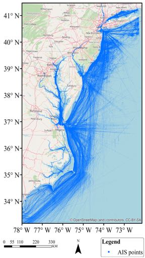

### FIGURE 2. Vessel types and their count in the dataset.

is very regular because of the high rate at which the AIS messages are transmitted [58]. This regularity provides the opportunity to compress the vessels’ trajectories to a much smaller volume without losing important information [58] and thus made it easy to store and analyze [59]. The trajectory compression refers to the elimination of points in a trajec- tory, which does not contain new information [60] to reduce the overall volume of data [59]. The trajectory compression accelerates [61], and improves the performance [59] of the further processes. The ultimate criterion for the quality of compression is in the extent to which the data can be com- pressed without damaging the use of the trajectory data for further processing [58]. Algorithms use different criteria to identify the splitting points [59] such as offset distance [62], time, velocity, or combinations of them, i.e., a combination of time and distance [59], or a combination of velocity and distance [58]. This paper employs three criteria for its trajectory sim- plification method: offset distance, logical consistency, and similarity. To maintain logical consistency, the topological signature of the original and simplified trajectory should be the same [63]. In practice, the vessels’ trajectories cannot intersect with the coastline. If there are some intersections generated through the compression process, the generated segment is void. This can be checked by validating the topological rela- tionship between the simplified trajectories and the coast- lines. Therefore, to compare the topological signature of the original and simplified trajectories, the proposed method checks the intersection of the trajectories segments and the coastlines. During the compression, the original trajectory deforms into a new geometry with a smaller set of vertices; the logical consistency [64] may be violated if these geome- tries are found within the convex hull of the set of vertices forming the trajectory [65]. Consider Fig. 3, which illustrates an example of the problem, the black line is an actual trajec- tory and the red one is the compressed one. A compressed trajectory passes into the shoreline, which is not logically consistent.

### FIGURE 3. Problems caused by non-topological trajectory compression.

In addition, the method is expected to maintain a bal- ance between the compression ratio of simplified trajectories and their similarity to the originals. To measure the simi- larity, the Dynamic Time Warping (DTW) method is used which warps trajectories non-linearly with varying sampling rates [66]. For trajectories Ti and Tj, this method minimizes the cumulative distance over potential paths between two vertices. Based on (3), it is possible to use different distance functions in the DTW [67]. DTW(Ti, Tj) = min Xn 1 δ(ws) (3) where n is the length of Tj and δ(ws) is a distance function. This work uses the Euclidean distance as a distance function in DTW. To build a new trajectory simplification method, this paper updates the two-stage Piecewise Linear Segmentation (2stage-pls) with the idea of Tienaah [63] et al. At first, it integrates contextual information to the PLS method, which seems to maintain logical consistency. The new method called a Context-aware Piecewise Linear Segmentation (CPLS) works in the following way. For a trajectory T with n vertices, the first and the last points, p1 and pn are selected and the Eµ is computed for all intermediate points, based on (4). E2 = q (xk −x0 k)2 + (yk −y0 k)2 (4) where the (x0k, y0k) is a point in the trajectory. If the computed Eµ is greater than the offset distance 2d, then it applies the procedure again, with the corresponding point pi. When there is no error greater than the given threshold, next for all other trajectory vertices p2, ..., p(n−1), it eliminates the first point p2. After that, it checks the consistency of the topological signature. If removing p2 destroys the topological signature, it adds it to the trajectory, again. Otherwise, it elim- inates p2 and continues the algorithm with the next point. The pseudo-code of the CPLS algorithm based on adding a topological signature is summarized in Algorithm 1. Although the CPLS is expected to solve the problem of illogically compressed trajectories, using it may lead to prob- lems related to retaining stops in trajectories. 45604 VOLUME 9, 2021

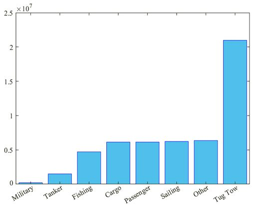

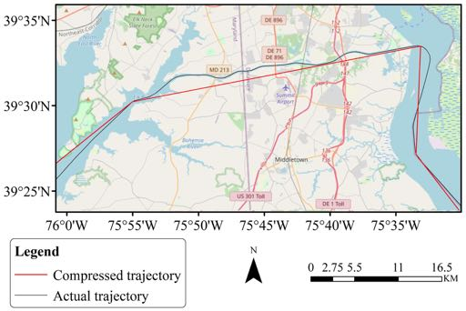

### Algorithm 1 Context-aware piecewise linear segmentation Input: trajectory T, offset distance 2d

1 Build topological relations for trajectory T 2 dmax = 0 3 imax = 0 4

### fori = 1to (n −1)

5 d = Eµ(Ti, T1, Tn) 6

### if d > dmax

7 imax = 1 8 dmax = d

### 9 ifdmax >2d then

10

### A = CPLS(T(1, imax), 2d)

11

### b = CPLS(T(imax, n), 2d)

12 Tc = A, B(2, n), Tc: compressed trajectory

### 13 else

14

### forj = 2to (n −1)

15 Tc = [T1, . . . , Tj−1, . . . , Tj+1, . . . , Tn], Tj is removed 16

### if topological signature is consistent then

17 j + + 18 gotoline14 19

### else

20 add vertex TjtoTc

### 21 returnTc

It may happen for a trajectory to be reduced in such a way that in the compressed trajectory it appears as if the vessel moves slowly, whereas in the original uncompressed trajectory the vessel stops moving for a period of time [58]. To deal with this problem the CPLS method is extended. Two heuristics are behind this extension. First, the stopping and moving points of vessels which are important in the behavior analysis, are more apparent in the derivative, i.e. the speed of the moving object, of the trajectory than in the trajectory itself [58]. Next, in some AIS messages, the status field has rich information about vessels’ movement, which can be useful to identify their stopping, and moving behavior. Accordingly, the extension to the CPLS trajectory compres- sion method, which is called the 2stage-CPLS, is proposed that can be seen in Algorithm 2. According to Fig. 4, for a given trajectory T = [p1, p2, ...., pn], first, the method starts to check the status field of each point. Supposed that the status field indicates the pi, pi+1, ...., pi+k are stay points, i.e. the status value indicates that the vessel is at anchor, the algorithm stores these points in a temporary variable sp. Next, it computes the centroid of pi, pi+1, . . . ., pi+k. Those points are eliminated and sub- stituted by their centroid. This continues with the remaining vertices of trajectory pi+k+1, pi+k+2, . . . ., pn. Also, the CPLS is applied to the speed time-series of the trajectory using a one-dimensional error measure Ev [58]. This error measure, for speed time series V of a trajectory T, is defined as follows: V = [v1, v2, . . . , vn] (5)

### FIGURE 4. Finding stay points using a state attribute of AIS messages,

adapted from [68]. Ev = q (vi −v0 i)2 (6) where vi is the speed of the vessel at point (xi, yi) and v0 i is the speed of the vessel at point (x0 i, y0 i ). The point (x0 i, y0 i ) is located on the line segment < x1, y1 >, < xn, yn >. Within the compression process conducted on the trajectory < x1, y1 >, < xn, yn >, the compression algorithm, calculates the error which is caused by eliminating each point (x0, y0 ) on the trajectory segment. Obviously, between two stay points, there must be some moving points [68], the point (x0, y0 ) which can be a stay point or moving points based on the situation. The one-dimensional error measure, Ev, is to compute the difference between the actual vi and the estimated peed v0 i. The pseudo-code of this method, i.e., the 2stage-CPLS method, is presented in Algorithm 2. The method uses the vessels’ speed that is estimated at the trajectory simplification stage. AIS data can have varying frequencies of transmission, which means the time interval between the two records can vary. Using the vessels’ speed, i.e. the ratio between distance and time interval, can help to adjust the traveled distance against the varying time intervals of AIS data and so we can handle the potentially varying AIS data transmission rate. B. CONTEXTUAL MOVEMENT PREDICTION This paper predicts vessel movement using a hybrid method, which makes it possible to combine the advantages of both physical and learning-based methods into a single predic- tion method. This follows the framework that is illustrated in Fig. 5. VOLUME 9, 2021 45605

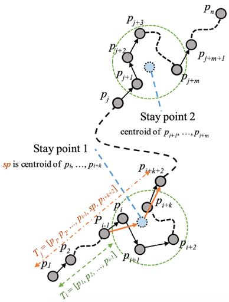

### Algorithm 2 Two-stage context-aware piecewise linear seg-

mentation

### Input: T, 2d, 2v

1 sp = ;, PA = ;, Tj = ;, Ti = ; 2 j = 1 3

### fori = 1 to n in trajcroty T

4

### if pi is not stay point

5

### if PA 6= ;

6

### sp = centroid(PA)

7 Append sp at the end of Ti 8 Append Ti into the Tj 9 Ti = ; 10 add pi into Ti 11

### Tv = CPLSEv(V, 2v)

12 Tc = ; 13

### for all vertices i and j in Tv

14

### Tv = CPLS(Ti,j, 2d)

15 Tc = Tc (1, n −1) , Tv 16

### returnTc FIGURE 5. Training and prediction framework.

C. CURVILINEAR MODEL The curvilinear model is capable of modeling a variety of motion patterns including linear, circular, and parabolic motions [35]. Equation (7) describes the standard discrete- time state system [35].

### xk+1(T) = Fxk(T) + Gk(T)(ak(T) + wk(T))

(7)

### where x is an input vector of vessels’ positions and F and

Gk(T) are two transition matrices that describe the nonlinear motion properties of the system [3]. Fig. 6, shows the ele- ments of the curvilinear model. Evaluation of matrix Gk(T) in (7), involves nonlinear matrix integral which is hard to be computed precisely [3].

### FIGURE 6. The curvilinear model, adapted from [3].

In this regard it is sensible to use the assumptions that Zhang [3] et al. made to simplify (7): 1) Most white-noise excitation wk can be caught by the time-varying discrete- time forcing matrix Gk(T), and 2) Vessels can only move in a horizontal plane, i.e., no vertical movement is possible. Having made these assumptions, the curvilinear models can be constructed with the standard curvilinear-motion mod- els from kinematics [3]. Also, de Vries [58] et al. show that high-frequency transmission of AIS messages makes it possible to assume the linearity of the vessels’ movement between two AIS messages. Therefore, both normal and tan- gential accelerations can be set to zero [58]. This also means that we can replace the curves with the linear segments and approximate the motion model of the vessels between two AIS messages as follows: Li = vi ⇥dti (8) dti = (ti+1 −ti) (9) ✓1xi 1yi ◆ = Li ⇥ ✓sin(8i) cos(8i) ◆ (10) ✓x0 i+1 y0 i+1 ◆ = ✓xi yi ◆ + ✓1xi 1yi ◆ (11) where vi and 8i are the velocity and course of vessels at ti, respectively. dti is a timestamp between two AIS messages. Li is a distance that the vessel moves during two AIS mes- sages. (xt, yt) is the actual coordinate, and (x0 t, y0 t) is the estimated coordinates of the vessel at ti. Based on the vessel’s current position (xt, yt), the current velocity vt, the current course 8t, velocity prior to current time vt−1, and the course 8t−1 prior to current time t, the method can predict positions of the vessel up to three future epoch. These three predicted positions can form a new trajectory T 0 = [(x0 t+1, y0 t+1), (x0 t+2, y0 t+2), (x0 t+3, y0 t+3)]. As it may not be possible to have all ideal environmental factors and states affecting the vessels’ movements, the predicted trajectory T 0, may not exactly fit the actual trajectory T. To match the predicted trajectory T 0 and the actual trajec- tory T, the deviation ⌧k, between estimated and actual coor- dinates should be computed. This paper introduces a method for computing ⌧k based on contextual data that considers the spatial and temporal components of movement to estimate the coordinates that have a minimum difference from the actual coordinates. The method which is called the context-aware 45606 VOLUME 9, 2021

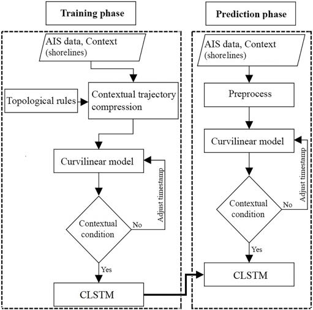

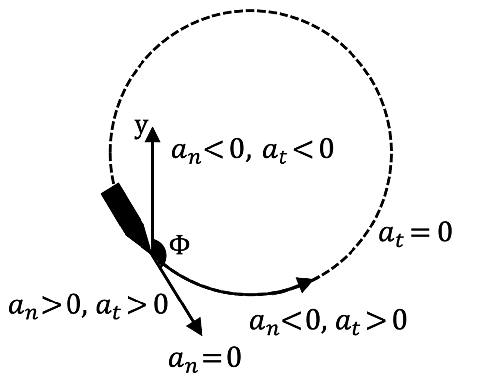

LSTM (CLSTM) network, is to improve the prediction accu- racy of movement prediction. D. CONTEXTUAL CONDITION As explained in C, trajectory T 0 that is estimated using a curvilinear model has to maintain the logical consistency, e.g., it must not cross land or crosses untraversable corridors obviously the vessels’ trajectories cannot cross the shorelines or islands. As shown in Fig. 7, in areas that are too close to shorelines the risk for T 0 to intersect with the shoreline can be higher. It is possible to avoid such problems by adjusting timestamp dt to monitor the movement at higher temporal accuracy, see (7). The timestamp is reduced to t↵is expressed by (12). t↵= (Pn i=1 dti). n (12) where n is the number of vertices of the trajectory and dti is a timestamp between two sequent trajectory vertices.

### FIGURE 7. An example of situations where T 0 which is estimated by the

curvilinear model is illogical. E. CLSTM STRUCTURE The vessel types, e.g. tanker, tug, cargo, can directly influence the maneuverability [14], which can have a high impact on the movement patterns. Therefore, vessel type seems to be a good classifier that is neither spatial nor temporal that can help minimize the risk of having Simpson Paradox, i.e. global learning model for the trajectory prediction of all vessel types. This paper provides a CLSTM model that considers the context, for predicting the movements of different but specific types of vessels. The LSTM networks can solve the long-term dependency problems. An LSTM unit consists of a cell, an input gate, an output gate and a forget gate. Fig. 8, illustrates an internal schematics of an LSTM cell unit. The illustrated structure in Fig. 8, allows for recursive feedback loops which can update the weights in real-time. This can prevent gradient disappearance and gradient expan- sion. The first step in an LSTM network training is the state initialization, in which the number of neural nodes of the

### FIGURE 8. An LSTM cell unit, internal schematics [27].

input layer, the number of output nodes, and the number of cell units are determined. Here, both the initial state of the cell and the link weight of each layer is set to be zero. Equation (13) calculates the output. ˜Hj = Xn i=1 Wijxi + ✓j (13) where wij is the link weigh, xi is an input unit and ✓j is the offset. The next step is to calculate the amount of information going to be thrown away from the cell state by the sigmoid layer, which is called the ‘‘forget gate layer’’. Equation (14) generates a number between zero and one indicating how much information is going to be kept. One means that all information is kept while zero indicates the elimination of all information. ft = σ(Wf [ht−1, xt] + bf ) (14) where ft is the forget gate, σ is a sigmoid and W is the weight matrix. The next step is to deal with information that is going to be stored in the cell state. At first, according to (14), an input gate layer (it) which is a sigmoid layer, decides which values are going to be updated. Then, the hyperbolic tangent (tanh) layer creates a vector for the new candidate values, ˜Ct, which can be added to the state. This is expressed by (15) and (16), respectively. it = σ(Wi[ht−1, xt] + bi) (15) ˜Ct = tanh(Wc[ht−1, xt] + bc) (16) The old state values (Ct−1) and the new candidate values ( ˜Ct), are respectively multiplied by the forget gate (ft) and the input gate (it). In (17), the summation of these two creates new cell values. Ct = ft.Ct−1 + ˜Ct.it (17) To finish the training process, the model runs a sigmoid layer to examine which parts of the cell state should be updated. These values are passed to the state value (ht) of the next unit as described in (18) and (19). ot = σ(Wo[ht−1, xt] + bo) (18) ht = ot. tanh(Ct) (19) Equation (19) passes the cell state to tanh which pushes values into a range of −1 to 1. Multiplying such values by the output of the sigmoid layer allows updating those parts that are important and effective. The square root of the difference VOLUME 9, 2021 45607

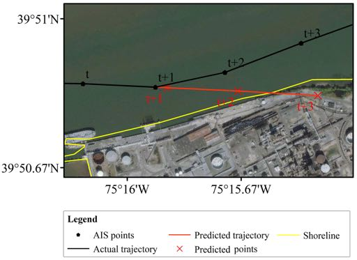

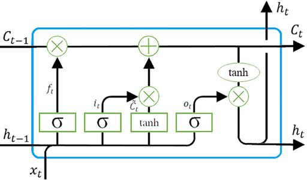

of output value (O) and expected output (y) is used as a measure of each batch training error, based on (20). ek = q y2 k −o2 k (20) For the learning process, a position is considered as a variable. The proposed method based on the CLSTM network can take three vertices of T 0 as its input and transform them into the corresponding vertices of T. An input layer can be expressed based on (21). It = {x0 t+1, y0 t+1, t + 1 x0 t+2, y0 t+2, t + 2 x0 t+3, y0 t+3, t + 3} (21) Equation (20) describes the output layer. O = {xpred t+1 , ypred t+1 xpred t+2 , ypred t+2 xpred t+3 , ypred t+3 } (22) The residuals, i.e Root Mean Square Error (RSME), can be calculated as follows: 1x = xpred −xactual (23) 1y = ypred −yactual (24) RMSE = sP(1x2 + 1y2) N (25) To measure the contributions of integrating contextual data to the prediction accuracy, the point-wise error [28] for both models can be calculated. The point-wise error is the distance between every pair of vertices, i.e. predicted vertex on 2D Cartesian and the actual coordinates.

### V. RESULTS

A. TRAJECTORY COMPRESSION In order to understand the effectiveness of the 2stage-CPLS compression method, 500 randomly selected trajectories are considered to test. These trajectories are compressed using the 2stage-PLS and the 2satge-CPLS and results are com- pared for better evaluation. In addition, for better evaluation, both methods are used in different settings to test different scenarios. In this regard, the offset distance 2d ranges from 0.02 to 2 km with increments of 0.02 allowing different parameters and scenarios to be tested. The speed offset 2v is set to be 1.54 m/s (3 knots), ie. Having different settings, 5000 compressed trajectories were created by each method. In order to evaluate and compare the performance and effectiveness of the 2stage-CPLS and the 2stage-PLS trajec- tory compression methods, two performance measures are used. They include the compression ratio R and the similarity of the compressed and the original trajectories. The R is defined by (26), and the similarity is measured based on (2). R = (1 −N( M) ⇥100% (26) where N is the number of trajectory vertices after compres- sion and M is before compression. Also, to evaluate the performance of the methods based on how much of the logical consistency of compressed trajectories are preserved. To do so, the topological relationships between the output sets, i.e. trajectories, and the geographic data that is used as contex- tual data are considered after compression. If compressed trajectories cannot maintain any of these relationships, e.g., crossing the shoreline, they are assumed to be logically inconsistent. All compressed trajectories are checked and compressed ones using the 2stage-CPLS do not have any intersection with shorelines which means that the 2stage- CPLS is able to maintain logical consistency. In contrast, most of the trajectories that were compressed with the 2stage- PLS seem to fail the logical consistency test for some of the cases. According to the experiments, the compression ratio of the 2stage-CPLS and the 2stage-PLS have different behavior based on compression ratio. As illustrated in Fig. 9, while the compression ratio of the 2stage-PLS increases by the increment of offset distance, the compression ratio of the 2stage-CPLS decreases gradually.

### FIGURE 9. The percentage of compression ratio.

For different offset distances, the compression ratios of the 2satge-PLS seem to sustainably higher than the 2satge- CPLS’s. The important vertices are the vertices of trajec- tories that must be kept in compression procedure in order to maintain the logical consistency or the spatial accuracy. Equation (26) defines the percentage of important vertices dR. dR = R2stage−PLS −R2stage−CPLS (27) The dR shows the percentage of vertices that their removal can fail the logical consistency of the compressed trajectories. As shown in Fig. 9, the 2stage-CPLS’s R seems to decrease as the offset distance increases. This means that the number of important vertices dR⇥100 can have a negative but direct correlation with the offset distance. During the compression process, the vertices of the trajec- tories which do not contain new information (due to the high transmission rate of the AIS messages) are removed, which may change the trajectory’s geometry [61]. The compression 45608 VOLUME 9, 2021

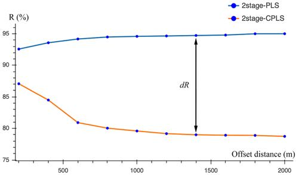

with a large offset distance can potentially have a larger geo- metrical change or deformation. This is illustrated in Fig. 10, which shows a trajectory compressed with the 2stage-PLS. In Fig. 10, the trajectory, which is compressed with a 200-meter offset (red line), has the smallest deformation. In addition, the topological signature of this trajectory has a slight difference from the raw trajectory (white line in Fig. 10). This trajectory in one place intersects with land (see the cyan array). The number of such intersections that destruct the logical consistency of compressed trajectories increases as the offset distance grows. To maintain logical consistency, those intersections have to be avoided. There- fore, the 2stage-CPLS method compares the topological relations of trajectories and contextual data to avoid such intersections by retaining important vertices. The large defor- mation means that the 2stage-CPLS has to retain more ver- tices. As a result, the R of the 2stage-CPLS decreases as offset distance increases.

### FIGURE 10. The relation of geometry deformation of compressed

trajectories and the applied offset distance. Learning-based methods for movement prediction, tend to mimic movement behaviors of vessels based on their histori- cal movement dataset [10]. Therefore one of the expectations after the compression process is such that the dataset keeps the representativeness of the variety of possible behavior. The compressed method should be able to compress trajectories while keeping logical consistency, the best replacements of initial trajectories, with maximum similarity to the initial trajectories. Therefore, for another evaluation measure, the similarities of compressed and raw trajectories for both meth- ods are compared. This is illustrated in Fig. 10. The 2stage- CPLS presented in this paper restores the removed vertices to resolve topological conflicts. As shown in Fig. 11, the similarity of trajectories com- pressed with the 2stage-PLS decreases as the offset distance increases. Based on experiments, the similarity measure for the 2stage-CPLS seems to converge. This makes it possi- ble to select an optimum offset distance for compression. At optimum offset distance, a compressed dataset seems to be the best replacement of the original dataset while it has less volume.

### FIGURE 11. The overall similarity of compressed trajectories to originals.

B. MOVEMENT PREDICTION To implement the proposed hybrid context-aware method, the AIS dataset is preprocessed and compressed with the 2stage-CPLS. The compressed dataset contains 52628 tra- jectories which 80% of which are used for training and the remaining for the validation process of the hybrid method (2satge-CPLS + CLSTM). In order to evaluate the prediction performance, two per- formance evaluation methods are used. They include RMSE and point-wise horizontal error. Moreover, the results of the proposed hybrid method are compared with the ordinary LSTM network (2satge-PLS + LSTM). In both methods, 80% of the dataset is used for the training process and 20% for their evaluation. For more detailed evaluation, the convergence effects of the proposed hybrid context-aware method (2satge-CPLS + CLSTM) and the ordinary LSTM network (2satge-PLS + LSTM) are compared. Both Fig. 12, and Fig. 13, illustrate the convergence effects of these methods. The AIS dataset that is used by this paper includes seven different types of vessels. They include tanker, tug, cargo, sailing, passenger, other, and fishing vessels. The ‘‘other’’ group type, refers to the group of vessels whose vessel type field is recorded as null [69]. Based on the architecture of the CLSTM network, it con- tains a unique LSTM deep learning neural network for each vessel type group. Therefore, used AIS dataset, the CLSTM network of this paper, is composed of seven LSTM networks. It can be clearly seen from Fig. 12, and Fig. 13, that the deep neural network predicts the movement behavior of the VOLUME 9, 2021 45609

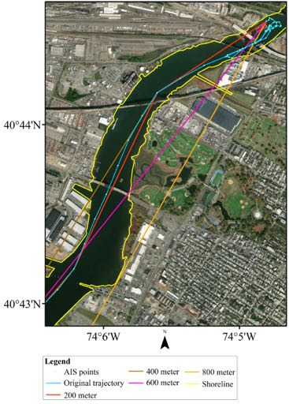

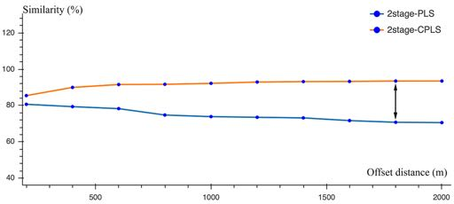

### FIGURE 12. Convergence effects of two methods: an ordinary LSTM

network (blue line in all figures), and the Hybrid method for tanker, tug, and cargo vessels. vessel. After predicting for a period, because the data of a single vessel in the verification dataset are limited, it was replaced with the data of the other vessel to continue the prediction and validation process. This change suddenly dete- riorates the prediction accuracy, but the prediction seems to be able to maintain performance and stabilizes in a short period of time. Such fluctuations of the validation accuracy, in the hybrid method (2satge-CPLS + CLSTM), are less than the ordinary LSTM network (2satge-PLS + LSTM). So, the convergence behavior of the hybrid method (2satge- CPLS + CLSTM) seems to be more predictable than the ordinary LSTM network (2satge-PLS + LSTM). The level of predictability of the convergence behavior can be the result of integrating the contextual information (e.g. the vessel type). The movement behavior of the vessels seems to be a function of the vessels’ type [14], [39], [40], [43], using a ‘personalized’ learning model for each vessel type, can improve the models’ learning process, as the model can simply focus on learning one type of behavior with fewer variations. Based on the convergence velocity, oscillation amplitude, and prediction accuracy, the proposed hybrid context-aware method (2satge-CPLS + CLSTM) seems to be superior to the ordinary LSTM (2satge-PLS + LSTM).

### FIGURE 13. Convergence effects of two methods: An ordinary LSTM

network (blue line in all figures) and the Hybrid context-aware method for sailing, passenger, other, and fishing vessels. In order to comprehensively analyze the proposed method, the average point-wise error is calculated which is summarized in Table 1. The outputs of both methods are compared to the actual trajectories.

### TABLE 1. Average of error in an LSTM network and hybrid method.

The results of vessels’ movement prediction with the 2satge-CPLS + CLSTM method are 15.68% more accu- rate than the ordinary LSTM network (2satge-PLS + LSTM), as demonstrated in Fig. 14, the actual trajectory, 45610 VOLUME 9, 2021

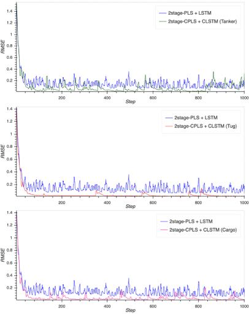

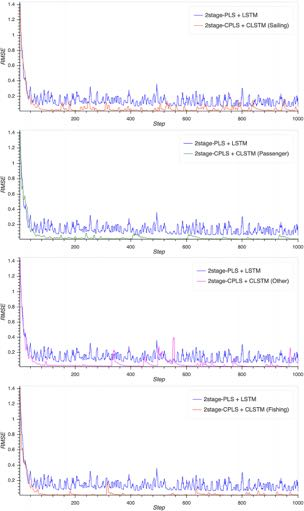

and the predicted trajectory with the hybrid context-aware method.

### FIGURE 14. Schematic of vessel behavior prediction using the hybrid

context-aware method.

### VI. CONCLUSION

Predicting vessels’ movement trajectory has an important role in the management of safety at sea. While the movement can be a function of geographic contexts, the current systems and methods rarely incorporate contextual information into the analysis. This paper introduces a novel approach for integrat- ing the contextual data in the movement prediction process, to improve the accuracy of the vessels’ trajectories prediction. The trajectory prediction based on the proposed method can provide security for navigation, assist in trajectory planning, and risk monitoring. This study provides a solution for both compression and movement trajectory prediction of the vessels. The paper improves the classic compression algorithm, by combining the contextual information in different stages of trajectory mining and prediction. The novel prediction method builds upon the strengths of both the curvilinear model and the deep learning LSTM network. The proposed hybrid method embeds contextual information as well as vessels’ historical AIS data to retain logical consistency and spatial accuracy for the predicted trajectories while increases prediction accuracy. Also, in order to avoid the Simpson paradox, for each vessel type, a unique LSTM network is trained to allow more accu- rate movement behavior predictions. Then, all LSTM units are combined into a single CLSTM structure. Moreover, this study introduces a way to calculate opti- mal offset distance by optimizing the similarity measures and compression ratio. The optimal threshold selection is to achieve the best trade-off between the similarity and the compression ratio for a dataset. In the optimal offset distance, the compressed trajectories are a very good replacement of the original dataset, while their volume of the dataset is also minimized. The experimental results showed that the 2stage-CPLS can potentially provide a higher trajectory similarity rate, improve the compression efficiency, and retain logical consistency. Compared to the 2stage-PLS algorithm, the proposed algo- rithm’s compression ratio seems to be lower than that of the classic algorithm, the similarity quality of the proposed algo- rithm is better. In the aspect of logical consistency, the 2stage- PLS algorithm may not seem to be as good as the proposed algorithm, and the geometrical changes of the trajectories seem to be higher. Based on the performed experiments, the proposed context-aware trajectory prediction method outperforms the ordinary LSTM network when it comes to the conver- gence velocity, oscillation amplitude, and prediction accuracy and it is 15.68% more accurate than the ordinary LSTM network. As future work, it is recommended to explore the effects of the environmental and sea factors (a wave height, a wind speed, etc.) on vessels’ movement prediction. Also, a related opportunity for future work can be on fleet movements, i.e. considering other objects and their topological relationships to achieve a better results.

### REFERENCES

[1] A. Mannov and P. A. Svendsen, ‘‘Transport 2040: Autonomous ships: A new paradigm for Norwegian shipping-technology and transforma- tion,’’ World Maritime Univ., Malmö, Sweden, Tech. Rep., 2019, doi: 10.21677/itf.20190715. [2] G. Dobie, ‘‘Safety and shipping review 2020, An annual review of trends and developments in shipping losses and safety,’’ Allianz Global Cor- porate Specialty Rep., Munich, Germany, Tech. Rep., 2020. [Online]. Available: https://agcs.wufoo.com/forms/download-agcs-safety-shipping- review-2020/ [3] E. Tu, G. Zhang, L. Rachmawati, E. Rajabally, and G.-B. Huang, ‘‘Exploit- ing AIS data for intelligent maritime navigation: A comprehensive survey from data to methodology,’’ IEEE Trans. Intell. Transp. Syst., vol. 19, no. 5, pp. 1559–1582, May 2018. [4] E. Akyuz, ‘‘A hybrid accident analysis method to assess potential nav- igational contingencies: The case of ship grounding,’’ Saf. Sci., vol. 79, pp. 268–276, Nov. 2015. [5] M. Abdelaal, M. Fränzle, and A. Hahn, ‘‘Nonlinear model predictive control for trajectory tracking and collision avoidance of underactu- ated vessels with disturbances,’’ Ocean Eng., vol. 160, pp. 168–180, Jul. 2018. [6] C. Hetherington, R. Flin, and K. Mearns, ‘‘Safety in shipping: The human element,’’ J. Saf. Res., vol. 37, no. 4, pp. 401–411, Jan. 2006. [7] X. D. Cheng, Z. Y. Liu, and X. T. Zhang, ‘‘Trajectory optimization for ship collision avoidance system using genetic algorithm,’’ in Proc. OCEANS- Asia Pacific, May 2006, pp. 1–5. [8] B. Murray and L. P. Perera, ‘‘A data-driven approach to vessel trajectory prediction for safe autonomous ship operations,’’ in Proc. 13th Int. Conf. Digit. Inf. Manage. (ICDIM), Sep. 2018, pp. 240–247. [9] B. L. Young, ‘‘Predicting vessel trajectories from AIS data using R,’’ Naval Postgraduate School, Monterey, CA, USA, Tech. Rep. 0704-0188, 2017. [10] D. Alizadeh, A. A. Alesheikh, and M. Sharif, ‘‘Vessel trajectory prediction using historical automatic identification system data,’’ J. Navigat., vol. 74, no. 1, pp. 156–174, 2020. [11] D. Zissis, E. K. Xidias, and D. Lekkas, ‘‘Real-time vessel behavior predic- tion,’’ Evolving Syst., vol. 7, no. 1, pp. 29–40, Mar. 2016. [12] L. P. Perera, P. Oliveira, and C. G. Soares, ‘‘Maritime traffic monitoring based on vessel detection, tracking, state estimation, and trajectory pre- diction,’’ IEEE Trans. Intell. Transp. Syst., vol. 13, no. 3, pp. 1188–1200, Sep. 2012. VOLUME 9, 2021 45611

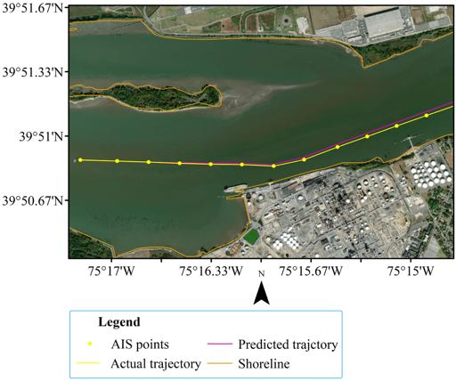

[13] L. M. Petry, A. Soares, V. Bogorny, and S. Matwin, ‘‘Unsupervised behavior change detection in multidimensional data streams for maritime traffic monitoring,’’ presented at the Montreal AI Symp., Westmount, QC, Canada, 2019. [14] T. Statheros, G. Howells, and K. M. Maier, ‘‘Autonomous ship collision avoidance navigation concepts, technologies and techniques,’’ J. Navigat., vol. 61, no. 1, pp. 129–142, Jan. 2008. [15] A. Alessandrini, F. Mazzarella, and M. Vespe, ‘‘Estimated time of arrival using historical vessel tracking data,’’ IEEE Trans. Intell. Transp. Syst., vol. 20, no. 1, pp. 7–15, Jan. 2019. [16] Y. Suo, W. Chen, C. Claramunt, and S. Yang, ‘‘A ship trajectory prediction framework based on a recurrent neural network,’’ Sensors, vol. 20, no. 18, p. 5133, Sep. 2020. [17] A. M. Thu, E. E. Htwe, and H. H. Win, ‘‘Mathematical modeling of a ship motion in waves under coupled motions,’’ Int. J. Eng. Appl. Sci., vol. 2, no. 12, pp. 97–102, 2015. [18] M. Buchin, S. Dodge, and B. Speckmann, ‘‘Similarity of trajectories taking into account geographic context,’’ J. Spatial Inf. Sci., vol. 2014, no. 9, pp. 101–124, Dec. 2014. [19] M. Sharif and A. A. Alesheikh, ‘‘Context-aware movement analytics: Implications, taxonomy, and design framework,’’ Wiley Interdiscipl. Rev., Data Mining Knowl. Discovery, vol. 8, no. 1, p. e1233, 2018. [20] S. Dodge, G. Bohrer, R. Weinzierl, S. C. Davidson, R. Kays, D. Douglas, S. Cruz, J. Han, D. Brandes, and M. Wikelski, ‘‘The environmental- data automated track annotation (Env-DATA) system: Linking animal tracks with environmental data,’’ Movement Ecol., vol. 1, no. 1, pp. 1–14, Dec. 2013. [21] K. Vijverberg, F. de Leeuw, E. Marchiori, and T. Heskes, ‘‘Object localiza- tion and path prediction using radar and other sources towards autonomous shipping,’’ M.S. thesis, Radboud Univ., Nijmegen, The Netherlands, 2018. [Online]. Available: https://www.semanticscholar.org/paper/Radboud- University-Object-Localization-and-Path-and-Vijverberg/ fbd287db41bff55956b9faf4a226a39efe96e6da#references [22] X. R. Li and V. P. Jilkov, ‘‘Survey of maneuvering target tracking. Part I. Dynamic models,’’ IEEE Trans. Aerosp. Electron. Syst., vol. 39, no. 4, pp. 1333–1364, Oct. 2003. [23] N. Zorbas, D. Zissis, K. Tserpes, and D. Anagnostopoulos, ‘‘Predicting object trajectories from high-speed streaming data,’’ in Proc. IEEE Trust- com/BigDataSE/ISPA, Aug. 2015, pp. 229–234. [24] L. M. Millefiori, P. Braca, K. Bryan, and P. Willett, ‘‘Modeling vessel kinematics using a stochastic mean-reverting process for long-term predic- tion,’’ IEEE Trans. Aerosp. Electron. Syst., vol. 52, no. 5, pp. 2313–2330, Oct. 2016. [25] G. Pallotta, M. Vespe, and K. Bryan, ‘‘Vessel pattern knowledge discovery from AIS data: A framework for anomaly detection and route prediction,’’ Entropy, vol. 15, no. 12, pp. 2218–2245, Jun. 2013. [26] S. Mao, E. Tu, G. Zhang, L. Rachmawati, E. Rajabally, and G.-B. Huang, ‘‘An automatic identification system (AIS) database for maritime trajectory prediction and data mining,’’ in Proc. ELM. Cham, Switzerland: Springer, 2016, pp. 241–257. [27] M. Gao, G. Shi, and S. Li, ‘‘Online prediction of ship behavior with automatic identification system sensor data using bidirectional long short- term memory recurrent neural network,’’ Sensors, vol. 18, no. 12, p. 4211, Nov. 2018. [28] Y. Liu and M. Hansen, ‘‘Predicting aircraft trajectories: A deep generative convolutional recurrent neural networks approach,’’ 2018, arXiv:1812.11670. [Online]. Available: http://arxiv.org/abs/1812.11670 [29] Z.-G. Zhang, J.-C. Yin, N.-N. Wang, and Z.-G. Hui, ‘‘Vessel traffic flow analysis and prediction by an improved PSO-BP mechanism based on AIS data,’’ Evolving Syst., vol. 10, no. 3, pp. 397–407, Sep. 2019. [30] P. Borkowski, ‘‘The ship movement trajectory prediction algorithm using navigational data fusion,’’ Sensors, vol. 17, no. 6, p. 1432, Jun. 2017. [31] M. A. Shahin, M. B. Jaksa, and H. R. Maier, ‘‘Artificial neural network applications in geotechnical engineering,’’ Austral. Geomech., vol. 36, no. 1, pp. 49–62, 2001. [32] L. Perera and C. G. Soares, ‘‘Ocean vessel trajectory estimation and prediction based on extended Kalman filter,’’ in Proc. 2nd Int. Conf. Adapt. Self-Adapt. Syst. Appl., Lisbon, Portugal, 2010, pp. 14–20. [33] B. Zhou and A. Shi, ‘‘LSSVM and hybrid particle swarm optimization for ship motion prediction,’’ in Proc. Int. Conf. Intell. Control Inf. Process., Aug. 2010, pp. 183–186. [34] A. Vemula, K. Muelling, and J. Oh, ‘‘Social attention: Modeling atten- tion in human crowds,’’ in Proc. IEEE Int. Conf. Robot. Autom. (ICRA), May 2018, pp. 4601–4607. [35] R. A. Best and J. P. Norton, ‘‘A new model and efficient tracker for a target with curvilinear motion,’’ IEEE Trans. Aerosp. Electron. Syst., vol. 33, no. 3, pp. 1030–1037, Jul. 1997. [36] S. Hochreiter and J. Schmidhuber, ‘‘Long short-term memory,’’ Neural Comput., vol. 9, no. 8, pp. 1735–1780, 1997. [37] A. K. Dey, ‘‘Understanding and using context,’’ Pers. Ubiquitous Comput., vol. 5, no. 1, pp. 4–7, 2001. [38] K. Ohtsu, G. Kitagawa, and H. Peng, ‘‘Statistical monitoring and clustering of ship’s time series,’’ IFAC Proc. Volumes, vol. 43, no. 20, pp. 52–57, Sep. 2010. [39] E. Filtz, E. S. de la Cerda, M. Weber, and D. Zirkovits, ‘‘Factors affecting ocean-going cargo ship speed and arrival time,’’ in Proc. Adv. Inf. Syst. Eng. Workshops, Cham, Switzerland: Springer, 2015, pp. 305–316. [40] T. Perez, Ship Motion Control: Course Keeping and Roll Stabilisation Using Rudder and Fins. Springer, 2006, p. 300. [41] E. M. Bitner-Gregerse, C. G. Soares, and M. Vantorre, ‘‘Adverse weather conditions for ship manoeuvrability,’’ Transp. Res. Procedia, vol. 14, pp. 1631–1640, Jan. 2016. [42] T. Perez, Ø. N. Smogeli, T. I. Fossen, and A. J. Sørensen, ‘‘An overview of the marine systems simulator (MSS): A simulink toolbox for marine control systems,’’ Model., Identificat. Control, A Norwegian Res. Bull., vol. 27, no. 4, pp. 259–275, 2006. [43] H. Lee, N. Aydin, Y. Choi, S. Lekhavat, and Z. Irani, ‘‘A decision sup- port system for vessel speed decision in maritime logistics using weather archive big data,’’ Comput. Oper. Res., vol. 98, pp. 330–342, Oct. 2018. [44] Ø. K. Kjerstad and M. Breivik, ‘‘Weather optimal positioning control for marine surface vessels,’’ IFAC Proc. Volumes, vol. 43, no. 20, pp. 114–119, Sep. 2010. [45] T. E. Notteboom, ‘‘The time factor in liner shipping services,’’ Maritime Econ. Logistics, vol. 8, no. 1, pp. 19–39, Mar. 2006. [46] C. Carletti, A. Gasparri, G. Ippoliti, S. Longhi, G. Orlando, and P. Raspa, ‘‘Roll damping and heading control of a marine vessel by fins-rudder VSC,’’ IFAC Proc. Volumes, vol. 43, no. 20, pp. 34–39, Sep. 2010. [47] A. Lachmeyer, B. Herzer, and E. D. Gilles, ‘‘Path planning for lock entering maneuvers using nonlinear programming,’’ IFAC Proc. Volumes, vol. 43, no. 20, pp. 58–61, Sep. 2010. [48] B. C. Simonsen, ‘‘Mechanics of ship grounding,’’ Ph.D. dissertation, Dept. Naval Archit. Offshore Eng., Tech. Univ. Denmark, Lyngby, Denmark, 1997. [49] H. Zhou, Y. Chen, and S. Zhang, ‘‘Ship trajectory prediction based on BP neural network,’’ J. Artif. Intell., vol. 1, no. 1, p. 29, 2019. [50] W. Kresse and D. M. Danko, Springer Handbook of Geographic Informa- tion. Springer, 2012. [51] NOAA. (2018). NOAA Medium Resolution Shoreline. [Online]. Available: https://coast.noaa.gov/htdata/Shoreline/us_medium_shoreline.zip [52] NOAA. (2018). AIS Data for 2017. [Online]. Available: https://coast. noaa.gov/htdata/CMSP/AISDataHandler/2017/index.html [53] X. Li, Z. Feng, Y. Li, Z. Liu, and R. W. Liu, ‘‘Spatio-temporal vessel trajectory smoothing using empirical mode decomposition and wavelet transform,’’ in Proc. IEEE 4th Int. Conf. Big Data Analytics (ICBDA), Mar. 2019, pp. 106–111. [54] G. Kouskoulis, C. Antoniou, and I. Spyropoulou, ‘‘A method for the treat- ment of pedestrian trajectory data noise,’’ Transp. Res. Procedia, vol. 41, pp. 782–798, Jan. 2019. [55] X. Chen, J. Ling, Y. Yang, H. Zheng, P. Xiong, O. Postolache, and Y. Xiong, ‘‘Ship trajectory reconstruction from AIS sensory data via data quality control and prediction,’’ Math. Problems Eng., vol. 2020, Aug. 2020, Art. no. 7191296. [56] A. Graser, ‘‘MovingPandas: Efficient structures for movement data in Python,’’ GI_Forum J. Geographic Inf. Sci., vol. 2019, no. 1, pp. 54–68, 2019, doi: 10.1553/giscience2019_01_s54. [57] F. Xiao, H. Ligteringen, C. van Gulijk, and B. Ale, ‘‘Comparison study on AIS data of ship traffic behavior,’’ Ocean Eng., vol. 95, pp. 84–93, Feb. 2015. [58] G. K. D. de Vries and M. van Someren, ‘‘Machine learning for vessel tra- jectories using compression, alignments and domain knowledge,’’ Expert Syst. Appl., vol. 39, no. 18, pp. 13426–13439, Dec. 2012. [59] A. Basiri, P. Amirian, and P. Mooney, ‘‘Using crowdsourced trajectories for automated OSM data entry approach,’’ Sensors, vol. 16, no. 9, p. 1510, 2016. [60] P. Zhao, Q. Zhao, C. Zhang, G. Su, Q. Zhang, and W. Rao, ‘‘CLEAN: Frequent pattern-based trajectory compression and computation on road networks,’’ China Commun., vol. 17, no. 5, pp. 119–136, May 2020. 45612 VOLUME 9, 2021

[61] S. Sun, Y. Chen, Z. Piao, and J. Zhang, ‘‘Vessel AIS trajectory online compression based on scan-pick-move algorithm added sliding window,’’ IEEE Access, vol. 8, pp. 109350–109359, 2020. [62] J. E. Hershberger and J. Snoeyink, ‘‘Speeding up the Douglas-Peucker line-simplification algorithm,’’ Dept. Comput. Sci., Univ. Brit. Columbia, Vancouver, BC, Canada, Tech. Rep., 1992. [63] T. Tienaah, E. Stefanakis, and D. Coleman, ‘‘Contextual Douglas-Peucker simplification,’’ Geomatica, vol. 69, no. 3, pp. 327–338, Sep. 2015. [64] F. Wang, ‘‘Handling data consistency through spatial data integrity rules in constraint decision tables,’’ Ph.D. dissertation, Universitätsbibliothek der Universität der Bundeswehr München, Neubiberg, Germany, 2008. [Online]. Available: https://www.unibw.de/geoinformatik/publikationen- und-vortraege/publikationen-fei-wang [65] A. Saalfeld, ‘‘Topologically consistent line simplification with the Douglas-Peucker algorithm,’’ Cartography Geograph. Inf. Sci., vol. 26, no. 1, pp. 7–18, Jan. 1999. [66] P. Senin, ‘‘Dynamic time warping algorithm review,’’ Inf. Comput. Sci. Dept. Univ. Hawaii Manoa Honolulu, USA, vol. 855, nos. 1–23, p. 40, 2008. [67] N. Vaughan and B. Gabrys, ‘‘Comparing and combining time series trajectories using dynamic time warping,’’ Procedia Comput. Sci., vol. 96, pp. 465–474, Sep. 2016. [Online]. Available: https:// www.sciencedirect.com/science/article/pii/S187705091631907X [68] Z. Yu, ‘‘Trajectory data mining: An overview,’’ ACM Trans. Intell. Syst. Technol., vol. 6, no. 3, pp. 1–41, 2015. [69] MarineCadastre.gov. (2019). AIS FAQ. [Online]. Available: https:// marinecadastre.gov/ais/faq/ SAEED MEHRI received the B.S. degree in civil engineering from the University of Tabriz, Tabriz, Iran, in 2013. He is currently pursuing the Ph.D. degree in geomatics engineering with the K. N. Toosi University of Technology, Tehran, Iran. His research interests include machine learning, com- putational movement analysis, and land use, and land cover change. Besides, he works well with different GIS technologies. ALI ASGHAR ALESHEIKH is currently an Aca- demician with the GIS Department, K. N. Toosi University of Technology, Tehran, Iran, and the Director of the Big Geodata Analytics and IoT Laboratory. He has been the Director of several national and international projects in the context of GIS analysis. He is a coauthor of numerous book chapters, and more than 200 papers in leading journals and conference proceedings. His research interest includes data science and technology with emphasis on spatial decision making. He chaired several conferences and received several awards for his contributions. ANAHID BASIRI is currently a Professor of Geospatial Data Science, and a UK Research and Innovation Future Leaders Fellow with the Univer- sity of Glasgow. She works on developing (theo- retical and applied) solutions that use positioning signals blockage and attenuation as useful data to extract 3D and indoor maps. For this, she leads an interdisciplinary team, and collaborates with aca- demic and industrial partners on several projects, including her UKRI Future Leaders Fellowship and European Research Council Starting Grant. She is an Editor of the Journal of Navigation. VOLUME 9, 2021 45613

